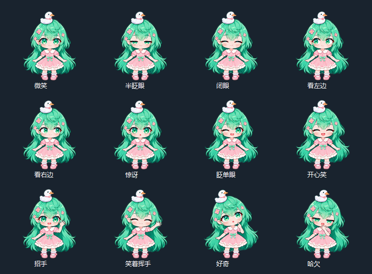

# ProgressGlass · 薄荷桌宠

[English](README.en.md) | 中文

一个轻量 Windows 桌面助手：用会眨眼、挥手的 Q 版桌宠，查看本机 Codex 聊天活动、账号额度快照和网络连通性。



## 功能简介

- **十二种表情**：薄荷绿长发、粉色裙装，支持自然眨眼、左右看、闭嘴微笑、惊讶、眨单眼、开心笑、招手、好奇和哈欠。
- **灵动交互**：靠近时看向鼠标，移入时招手，点击时开心回应并小幅弹跳，拖动时惊讶、松开后回弹；闲置时轻呼吸、摆动并偶尔变换表情。
- **轻柔模式**：右键可减少身体摆动、弹跳和装饰闪光，保留眼睛与嘴型变化。
- **悬停任务气泡**：悬停展开，点击固定，拖动角色调整位置；支持多聊天翻页。
- **跨项目活动列表**：读取当前本机 Codex 用户目录，显示尚未结束的聊天回合、工具等待和可识别的确认请求；结束或中断后自动隐藏。
- **真实活动记录**：显示最近事件及静默时间；不把等待时间、动画、阶段数量或 token 消耗伪装成完成百分比。
- **额度快照**：读取最新的本地 Codex 限额记录，显示剩余比例、记录时间和重置时间；较旧快照与过期窗口明确标注。
- **网络探测**：通过系统代理访问同域公开资源，区分成功、验证要求、HTTP 错误和超时。不会把网页探测结果当作模型生成连接的状态。
- **角色头像图标**：托盘、窗口和程序文件使用同角色头像，含 16–256 像素的 9 档 Windows 图标。
- **可选数量指标**：支持带单位、来源和观测时间的实际计数。保留旧矩形进度视图和原子更新脚本。

## 下载与启动

1. 打开本仓库的 [最新版本](https://github.com/D-admin/ProgressGlass/releases/latest)，下载 `ProgressGlass-v0.4.3-windows.zip`。
2. 将 ZIP **完整解压**到你有写入权限的目录，例如文档文件夹；不要直接在压缩包内运行。
3. 双击 `ProgressGlass.exe`。必须保留同目录的 `assets` 文件夹。
4. 桌宠默认出现在主屏幕右下方。启动时会读取本机会话历史，首次扫描可能需要几秒。
5. 正常使用 Codex；将鼠标移到桌宠上查看气泡。

需要 Windows 10/11、.NET Framework 4.8 或兼容运行时。程序为 WinForms 桌面软件；不支持 macOS、Linux 和浏览器扩展。可执行文件未进行商业代码签名，不需要安装服务或管理员权限。

没有本地 Codex 会话时，程序仍能显示桌宠，但活动列表和额度可能不可用。软件不需要 API Key。

从旧版升级时，先退出旧桌宠，再完整解压新版到新目录；新版需要新的表情图集，不能只替换 EXE。需要保留位置、大小时，可将旧目录的 `pet-settings.json` 复制到新目录。

## 操作步骤

| 操作 | 效果 |
| --- | --- |
| 鼠标靠近角色 | 眼睛看向附近鼠标 |
| 鼠标悬停角色 | 招手并展开任务气泡 |
| 鼠标移出角色与气泡 | 未固定时约 0.65 秒后收起 |
| 单击角色 | 开心回应并固定气泡；再次单击收起 |
| 按住角色拖动 | 惊讶表情，移动并保存位置；松开后轻微回弹 |
| 气泡右上角“固定”或“×” | 固定或关闭气泡 |
| 气泡底部左右箭头 / 滚轮 | 翻阅更多活动聊天 |
| 右键角色 / 托盘图标 | 调整大小、切换轻柔模式、显示气泡、隐藏或退出 |
| `Ctrl+Alt+P` | 显示 / 隐藏桌宠 |
| `Ctrl+Alt+O` | 展开固定 / 收起气泡 |

角色提供 96、128、160 逻辑像素三档大小，会跟随 Windows 显示缩放。Windows 将触摸转换为鼠标输入时可使用点击目标；触摸屏硬件体验尚未实测。快捷键冲突时可用托盘菜单。

## 如何理解状态

- **最近有活动**：本地记录刚出现开始、助手输出、推理元数据或工具事件。
- **等待工具返回**：记录了工具调用，但尚未观察到对应返回。
- **等待新事件 / 长时间没有新事件**：分别对应至少 30 / 120 秒静默；不能区分思考、网络等待和停滞。
- **回合结束 / 中断**：从活动列表移除，仅表示这次回合结束，不代表整个项目完成。
- **连接探测通过**：`https://chatgpt.com/robots.txt` 返回 HTTP 200，且内容类型和格式匹配。不会自动断言生成请求正常。
- **网站要求浏览器验证 / HTTP 错误**：探测受限；不能仅据此认定聊天断线、账号被封或额度用尽。

会话每秒在后台增量读取；新文件和聊天标题约每 10 秒发现；网络每 30 秒检测一次。动画只作装饰，不表示进度或心跳。

## 数据范围与隐私

会话来源为 `$CODEX_HOME/sessions`；未设置环境变量时使用 `%USERPROFILE%\.codex\sessions`，聊天名来自 `session_index.jsonl`。

仅覆盖本机当前目录中的用户会话，不覆盖其他设备、云端任务或其他账号目录；内部子代理与审查会话不单独列出。会话文件格式变化可能影响识别。

程序读取事件元数据，不显示或上传对话、推理正文或工具内容。唯一主动联网行为是每 30 秒向 ChatGPT 的公开资源发送不带账号凭证的连接探测请求。

运行后，程序会在自身目录生成个人配置与诊断文件：

- `pet-settings.json`：角色位置和大小。
- `runtime.json`：本地诊断，包括会话标题、路径、活动和额度；**请勿公开上传**。
- `settings.json`：使用旧矩形视图时的个人设置。
- `usage-snapshot.json`：可选的人工导入额度快照，默认不提供。

发布包不包含开发者的对话、个人配置、真实会话 ID、账号额度或开发过程记录；`progress.json` 和 `examples` 均为通用示例。

额度通常只有会话写入新记录时才更新，超过 5 分钟标为较早快照；达到记录的重置时间后显示“待更新”。切换账号后，旧记录无法可靠区分账号，应以客户端显示为准。

## 可选：登记可核实的进度

编辑 `progress.json` 记录当前动作和证据。未知总工作量时只更新状态，**不要填估计百分比**。

```powershell
.\update-progress.ps1 -TaskId sample -Status doing -Evidence '已验证的实际结果' -Current '当前执行动作'
```

有真实数量时登记实际观测值：

```powershell
# 演示命令；将数量与来源替换为实际观测结果。
.\update-progress.ps1 -TaskId sample -Status doing -MeasuredCompleted 240 -MeasuredTotal 1000 -Unit '条' -Source 'worker-result.json'
```

任务状态支持 `todo / doing / blocked / review / done`；`done` 需要验证证据，带计数的任务还必须真正达到总量。脚本不会补满计数。任务指标不会平均为项目完成率。

桌宠聊天行可显示匹配 `monitor.sessionId` 的项目 `current` 和独立项目 `measurement`；`monitor` 的 `sessionPath` 必须是对应本地 JSONL 的绝对路径，`sessionId` 必须与其首条 `session_meta` 一致。默认模板不绑定任何聊天。

## 从源码构建

在 Windows PowerShell 5.1+ 或 PowerShell 7 中进入仓库目录：

```powershell
.\build.ps1 -OutputDirectory .\dist
.\test.ps1 -ArtifactDirectory .\test-results
# 修改头像后重新打包 ICO（可选）
.\make-icon.ps1
```

构建使用 Windows .NET Framework 自带的 `csc.exe`，无需 Node.js、Python、NuGet 或付费生成服务。测试仅使用本地模拟数据和仓库中的 `examples/blank-progress.json`。构建会将 `assets` 复制到输出目录，并在该目录缺少 `progress.json` 时从通用模板创建；已有记录不会覆盖。根目录的个人 `progress.json` 被 Git 忽略，干净检出即可构建和测试。

开发命令：`--render-style preview.png` 导出十二种表情预览；`--render-animation frames` 导出一段交互动画的 PNG 帧序列；`--render-pet preview.png` 导出真实气泡快照（会读取本地状态并探测网络）；`--legacy` 打开旧矩形视图；`--windowed` 让桌宠显示任务栏按钮，供调试使用。

## 许可证与素材

代码采用 [Microsoft Reciprocal License（MS-RL）](LICENSE)。部分 Win32 辅助代码来自 [OnTopReplica](https://github.com/LorenzCK/OnTopReplica)，完整来源见 [THIRD-PARTY-NOTICES.txt](THIRD-PARTY-NOTICES.txt)。发布包附带对应源码。

角色素材由 AI 辅助生成，随软件提供；参见 [素材说明](assets/NOTICE.txt)。本项目为独立工具，与 OpenAI 或上游项目没有官方隶属或背书关系。
